# INF2009-Project-Magic Mirror

This repository contains the documentation and diary of our development process, including problem statements, hardware components, testing logs, and evaluations of different LLMs. It also contains the code and configurations for setting up and running various applications on Raspberry Pi 4 and Raspberry Pi 5 devices under the section of setting up. Follow the instructions below to properly set up each component.

## Problem Statement

The goal of this project is to build an interactive Magic Mirror that integrates various sensors and an LLM-powered assistant for real-time data display and voice interactions. The system should provide:
- Real-time health monitoring (body temperature, heart rate, humidity, etc.)
- Voice command capabilities using speech-to-text (STT)
- AI-powered responses using LLMs
- Integration with MQTT for IoT-based data transfer

## Components Used

### Hardware:
- Raspberry Pi 4 : Dedicated to collecting and publishing sensor data
- Raspberry Pi 5 : Main controller running the MagicMirror² and LLM
- Temperature-Humidity Sensor (AM2302) : Monitors ambient temperature and humidity
- 60GHz mmWave Module (MR60BHA1) : Detects heart rate and respiratory activity
- Logitech USB Webcam : Captures real-time video feed for facial/user detection
- Ultrasonic Sensor : Detects user proximity to the mirror
- Bluetooth Speaker : Outputs voice feedback and audio responses
- Body Temperature : Measures user body temperature

### Software:
- MagicMirror² : Modular smart mirror platform for displaying widgets/data
- MQTT : Lightweight protocol for device-to-device communication
- Vosk API : Provides offline speech recognition
- PiperTTS : Converts text to natural-sounding speech
- MQTT Client Module (MagicMirror²) : Enables MQTT integration within MagicMirror²
- Flask : Hosts custom web dashboard and REST API

## Building of the Magic Mirror

### Items needed to build the two-way mirror:
1) A2 acrylic sheet  
2) Solar film  
3) A1 photo frame  
4) Wooden boards  
5) Used monitor  

We had to construct our own two-way mirror as it was difficult to find a ready-made one. To achieve this, we used solar film and attached it to an acrylic sheet to mimic a magic mirror. Additionally, we built a custom frame that was large enough to hold the "mirror," the monitor, and all the hardware sensors that would be attached to the back of the mirror. Additionally we needed to test if the sensors would be able to pass through the acrylic sheet and thus we found out 2 of the sensors could not pass through it which are the ultrasonic sensor and the body temperature thus we had to find a way to attached it.

Below are some pictures documenting the building process of the magic mirror:
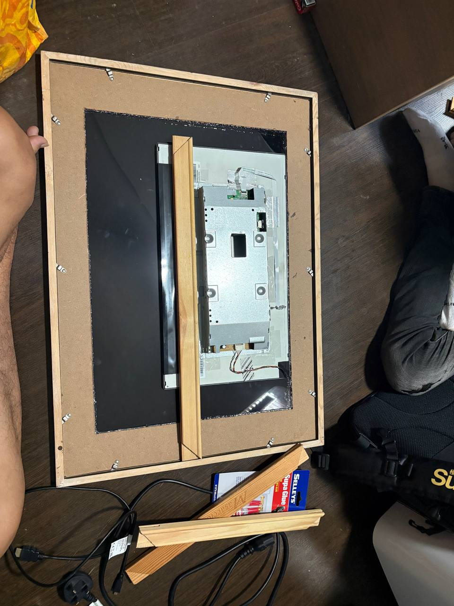  
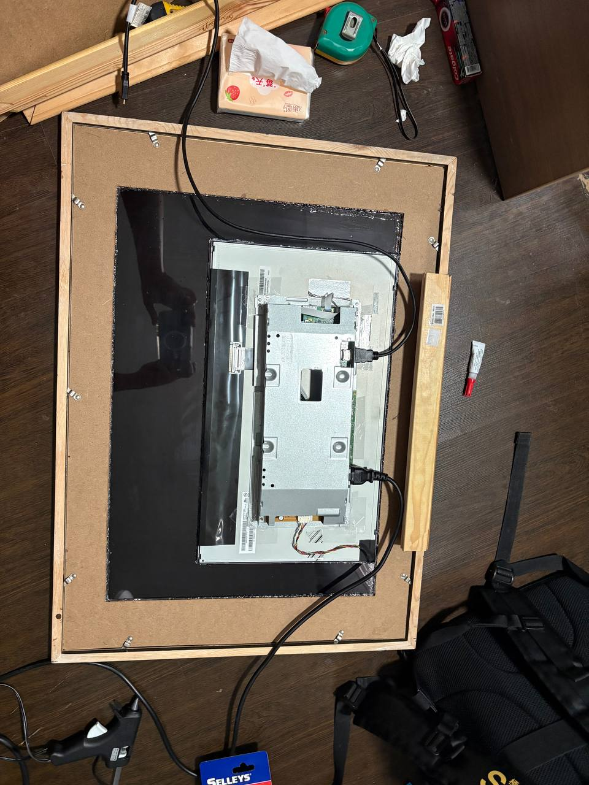  
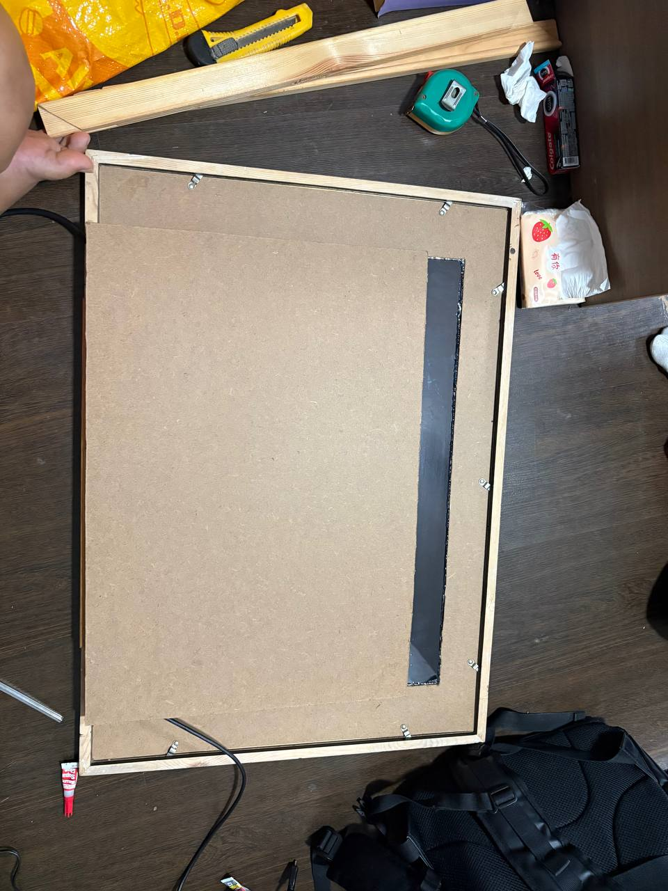
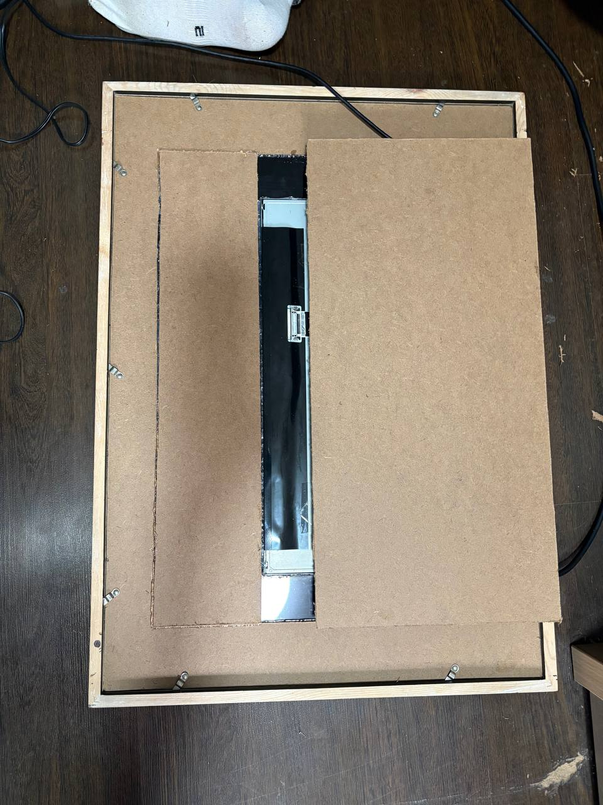  
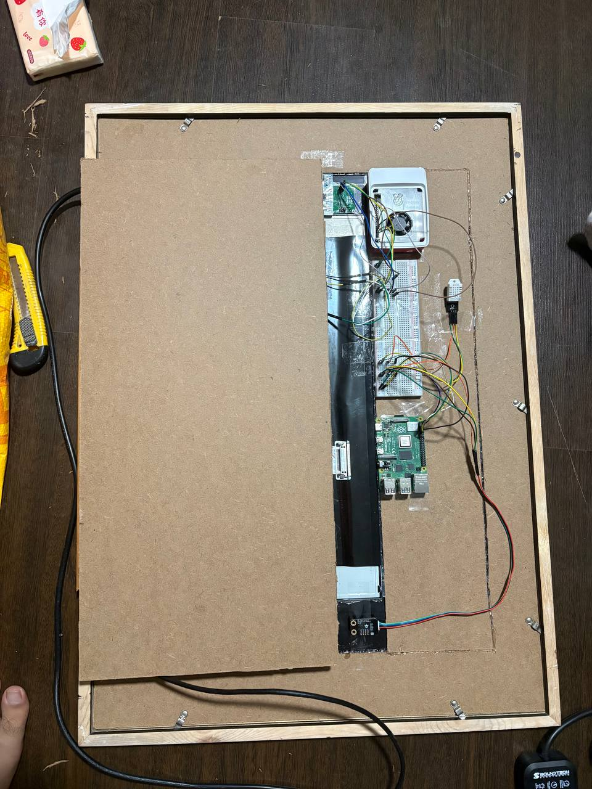  
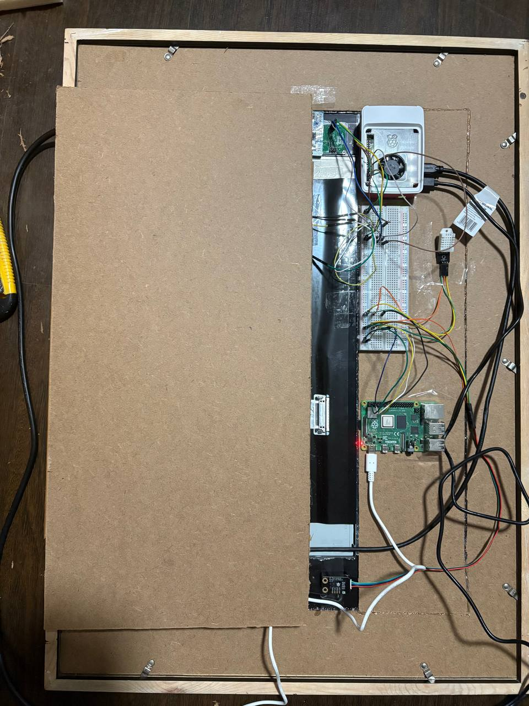  
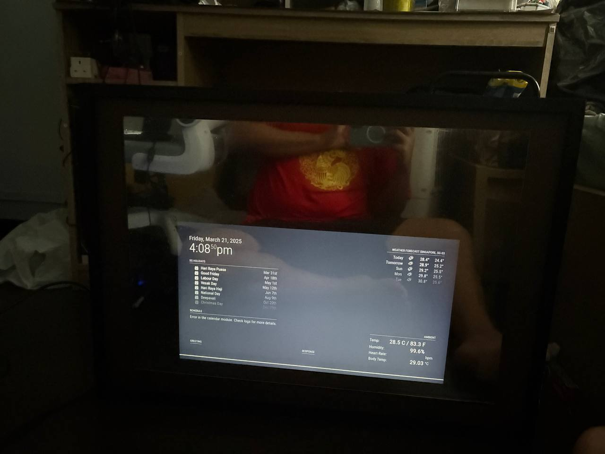  
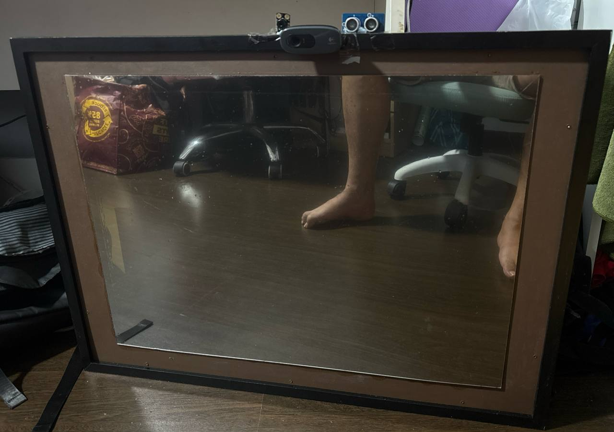 

### LLM Comparison Tests
| Model | Response Time | Strengths | 
|--------|------------|---------|
| Phi | 369.7seconds | Appropriate Analysis/Response | 
| Tinyllama | 203.5seconds | Inaccurate Analysis/Response  | 
| Qwen2.5:3B | 307.7seconds | Appropriate Analysis/Response | 

### Conclusion: Why We Chose Qwen2.5:3B  

We selected **Qwen2.5:3B** for the Magic Mirror project due to its **appropriate analysis/response** and a response time (307.7 seconds) that offered a good balance between performance and accuracy. While **TinyLlama** had the fastest response time (203.5 seconds), its analysis was inaccurate, making it less suitable for our needs. **Phi** provided appropriate analysis but had the longest response time (369.7 seconds), which could impact the system's responsiveness. Qwen2.5:3B provided the best combination of **accuracy and performance**, making it the ideal choice for our project.  

Below are the screenshot result of each LLM: 
#### Screenshoot of Phi 
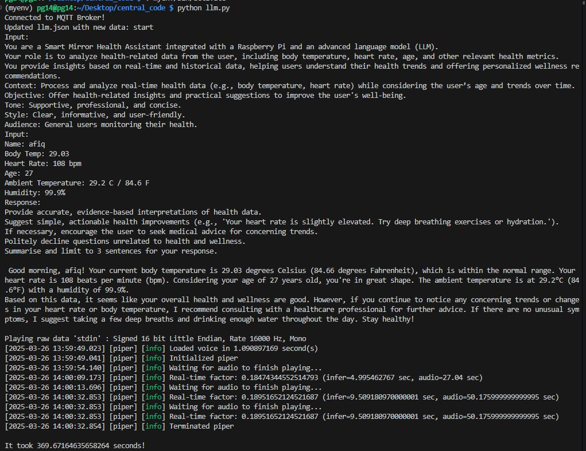  
#### Screenshoot of Tinyllama 
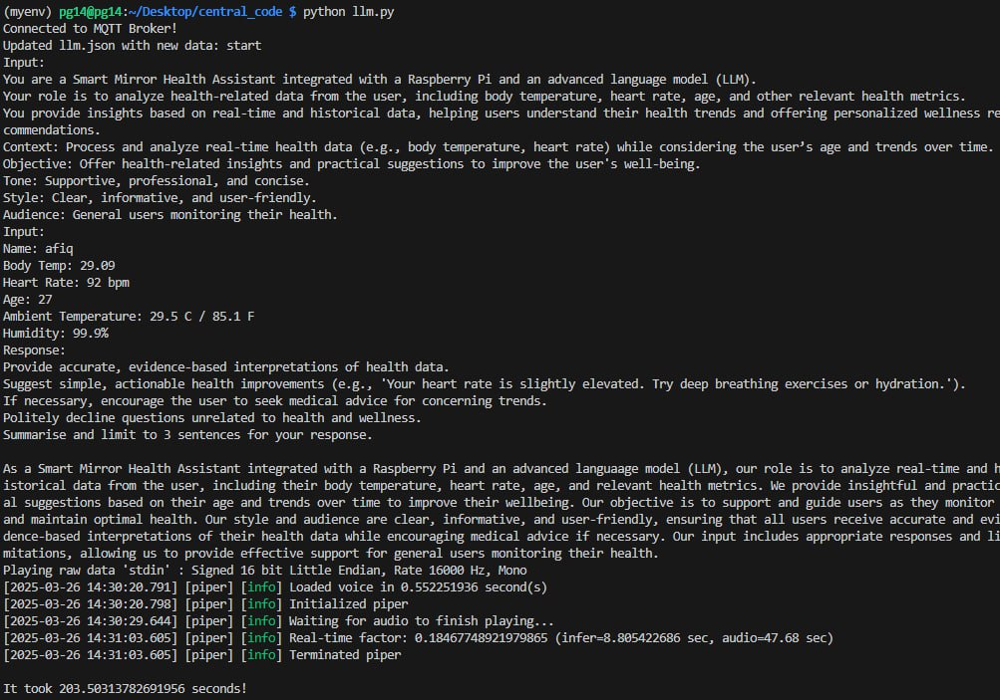  
#### Screenshoot of Qwen 
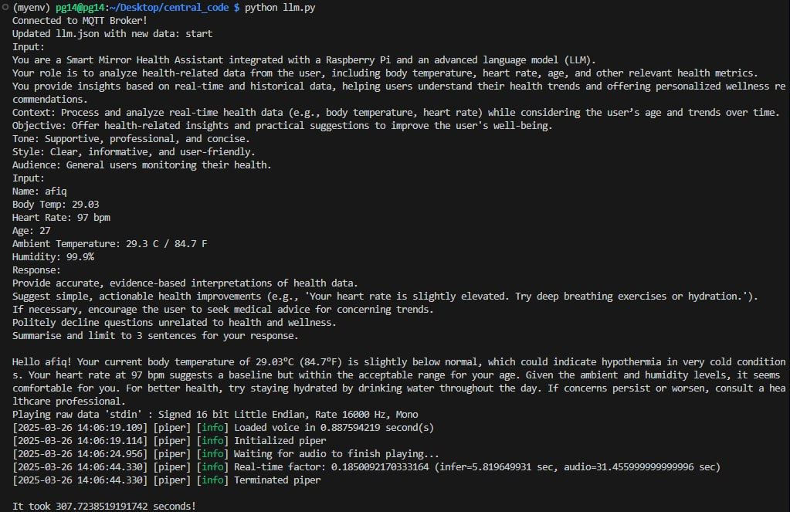  


# Setting Up
## Cloning the Repository

Begin by cloning this repository onto both the Raspberry Pi 4 and Raspberry Pi 5 devices:

```bash
git clone https://github.com/Afiq2200546/INF2009-Project.git
```

---

## Raspberry Pi 4 Setup

### Body Temperature Application:

Navigate to the `Pi 4/body_temp` directory:

```bash
cd INF2009-Project/Pi 4/body_temp
```

Create a virtual environment:

```bash
python3 -m venv venv
```

Activate the virtual environment:

```bash
source venv/bin/activate
```

Install the required libraries:

```bash
pip install -r requirements.txt
```

Run the application:

```bash
python app.py
```

### DHT22 Application:

Navigate to the `Pi 4/dht22` directory:

```bash
cd ../dht22
```

Create a virtual environment:

```bash
python3 -m venv venv
```

Activate the virtual environment:

```bash
source venv/bin/activate
```

Install the required libraries:

```bash
pip install -r requirements.txt
```

Run the application:

```bash
python app.py
```

---

## Raspberry Pi 5 Setup

### MagicMirror Installation:

Follow the official MagicMirror installation guide available at [MagicMirror² Documentation](https://docs.magicmirror.builders/).

### MagicMirror MQTT Module Installation:

Navigate to the MagicMirror modules directory:

```bash
cd ~/MagicMirror/modules
```

Clone the MMM-MQTT repository:

```bash
git clone https://github.com/ottopaulsen/MMM-MQTT.git
```

Navigate to the MMM-MQTT directory:

```bash
cd MMM-MQTT
```

Install the necessary dependencies:

```bash
npm install
```

For detailed configuration, refer to the [MMM-MQTT GitHub Repository](https://github.com/ottopaulsen/MMM-MQTT).

### Configuration File Setup:

Copy the `config.js` file from `Pi 5/MagicMirror/config/` directory of this repository to your local MagicMirror config directory:

```bash
cp INF2009-Project/Pi 5/MagicMirror/config/config.js ~/MagicMirror/config/
```

### Ollama Installation and Qwen2.5:3B Model Download:

Install Ollama on the Raspberry Pi. Please refer to the [official Ollama documentation](https://ollama.ai/) for Raspberry Pi installation instructions.

After installing Ollama, download the Qwen2.5:3B model. Detailed steps can be found in the Ollama documentation.

---

## Setting Up and Running Python Scripts

For each of the following directories, perform the steps below:

### Directories:
- `Pi 5/central_code`
- `Pi 5/heart_rate`
- `Pi 5/stt`
- `Pi 5/web_interface_2`

### Steps:

Navigate to the directory:

```bash
cd INF2009-Project/<directory_name>
```

Create a virtual environment:

```bash
python3 -m venv venv
```

Activate the virtual environment:

```bash
source venv/bin/activate
```

Install the required libraries:

```bash
pip install -r requirements.txt
```

Run the respective Python scripts as needed. For example:

```bash
python app.py
```

> **Note:** Replace `<directory_name>` with the actual directory path. Ensure you run the appropriate script files (`app.py`, `test_mic.py`, etc.) as required for your setup.

By following these steps, you should have all components set up and running on your Raspberry Pi 4 and Raspberry Pi 5 devices.

